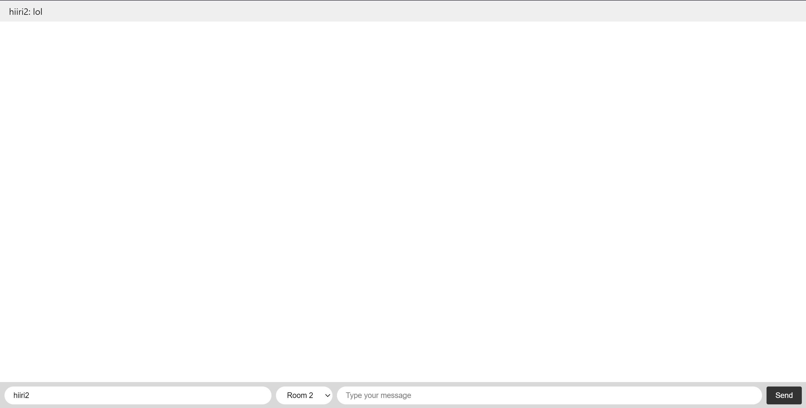

## Assignment - Chat application with Socket.IO

I created a simple chat app using the tutorial on the socket.io website.

# Text input field and broadcasting messages to other users on the page:

# User can give a nickname when sending a message:

# User a choose a chat room and post a message there:

# Namespaces in Socket.io

Namespaces are a way to divide the connection into different channels, allowing you to create multiple isolated communication paths under the same server. They are used when you want to separate different parts of your application that should not interact with each other. For example, you might have one namespace for chat functionality (/chat) and another for notifications (/notifications). They differ from rooms since they divide the entire connection space, creating isolated communication channels. Rooms are scoped within a namespace and provide a way to group sockets together within that namespace.
